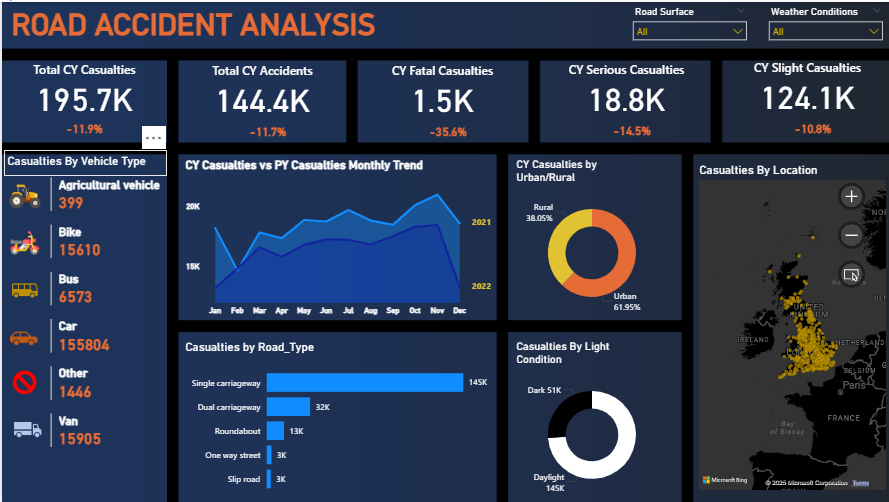

## 🚦 Road Accident Analysis Dashboard

## 📌 Overview

The Road Accident Analysis Dashboard is an interactive Power BI project that provides insights into road accident patterns, casualties, and contributing factors.
It leverages accident datasets to identify trends by vehicle type, road type, light conditions, and location, helping policymakers and organizations take informed safety measures.

## 🎯 Objectives

Track total casualties, accidents, and severity levels

Identify high-risk vehicle types involved in accidents

Compare current vs previous year accident trends

Visualize accidents by urban/rural areas, light conditions, and road types

Provide location-based insights with interactive maps

## Key Features
    
✅ Comprehensive accident statistics – fatalities, serious, and slight casualties
✅ Vehicle type distribution – car, bike, bus, van, etc.
✅ Urban vs rural accident split
✅ Light condition analysis – daylight vs dark
✅ Road type risk assessment – single carriageway, dual carriageway, etc.
✅ Interactive filters – weather conditions & road surface
✅ Geospatial mapping of accident hotspots

## 🛠️ Tools & Technologies

Power BI Desktop – for visualization

Microsoft Excel – dataset source

Data Analytics & Visualization – insights & reporting

## 📸 Dashboard Highlights

Total Casualties (CY): 195.7K (↓ 11.9%)

Total Accidents (CY): 144.4K (↓ 11.7%)

Fatal Casualties: 1.5K (↓ 35.6%)

Serious Casualties: 18.8K (↓ 14.5%)

Slight Casualties: 124.1K (↓ 10.8%)

Source: Road Accident Dataset 2021–2022

## 📈 Use Cases

🚗 Government Agencies – Identify accident-prone areas & improve road safety
📊 Transport Authorities – Analyze accident patterns to improve infrastructure
🏢 Insurance Companies – Assess risk factors for different vehicle types
👨‍💻 Data Analysts – Explore accident datasets for trend insights
